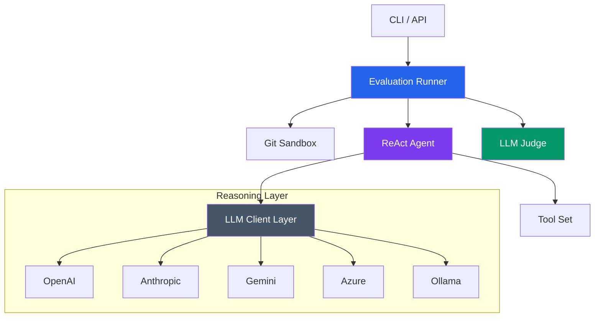

# Rails Agent Eval 🚀

<div align="center">
  
  <p><em>The gold standard for benching AI agent performance in real-world Ruby on Rails environments.</em></p>
</div>

---

## 💎 The Vision

`rails-agent-eval` is a high-fidelity evaluation engine designed to rigorously validate AI agent skills, context hydration strategies, and reasoning workflows. It orchestrates side-by-side execution runs within **Isolated Git Sandboxes**, providing objective, data-driven insights into agent reliability and code quality.

---

## ✨ Premium Features

- **🎭 Side-by-Side Evaluation**: Quantify the "ROI of Context" by comparing baseline vs. skill-enhanced agent runs.
- **🛡️ Isolated Git Sandboxes**: Every run operates in a temporary repo. Clean diffs, zero side-effects, 100% reproducibility.
- **⚖️ LLM-Powered Judging**: Automatic, objective scoring of code changes against granular, task-specific criteria.
- **🔄 Sophisticated ReAct Loop**: Employs a robust `Thought → Tool → Observation` loop to handle complex, multi-step engineering tasks.
- **🌍 Multi-Provider Ecosystem**: Native support for **OpenAI**, **Anthropic**, **Google Gemini**, **Azure OpenAI**, and **Ollama**.
- **📊 Standardized Intelligence**: Consistent reporting format regardless of the underlying LLM provider.

---

## 🏛️ Architecture Overview

The system decoupling allows the reasoning engine to remain agnostic of the execution environment.



---

## ⚙️ Configuration & Orchestration

### Environment Variable Mapping

| Provider | Required Env Variables | Registry Key |
| :--- | :--- | :--- |
| **OpenAI** | `OPENAI_API_KEY` | `:openai` |
| **Anthropic** | `ANTHROPIC_API_KEY` | `:anthropic` |
| **Gemini** | `GEMINI_API_KEY`, `GEMINI_PROJECT_ID` | `:gemini` |
| **Azure** | `AZURE_OPENAI_API_KEY`, `AZURE_OPENAI_ENDPOINT` | `:azure` |
| **Ollama** | `OLLAMA_MODEL` (e.g., `qwen2.5-coder`) | `:ollama` |

### Pro-Tip: Token Optimization with `rtk`
> [!TIP]
> This repository is optimized for **Rust Token Killer (rtk)**. Use `rtk git status` or `rtk gain` to track your token savings while developing agent scenarios.

### Global Configuration
```ruby
Evaluator::Config.configure do |config|
  config.llm_provider = :anthropic # Choose from :openai, :anthropic, :gemini, :azure, :ollama
  config.timeout      = 180        # Generous timeout for complex reasoning
end
```

---

## 🚀 Getting Started

### Installation
Add to your `Gemfile`:
```ruby
gem 'rails-agent-eval', github: 'igmarin/rails-agent-eval'
```

### Usage: The 3-Step Flow

#### 1. Define the Scenario
Create `evals/refactor-controller/task.md` with the agent's objective.

#### 2. Define the Criteria
Create `evals/refactor-controller/criteria.json` with weighted scoring items.

#### 3. Run the Bench
```bash
bundle exec evaluate --eval evals/refactor-controller --skill skills/service-objects
```

---

## 🛡️ Reliability & Security

- **Safe-by-Design**: No code execution occurs on the host system; everything happens in the sandbox.
- **Traceability**: Every thought and tool call is logged for post-mortem analysis.
- **Robust Error Recovery**: Handles provider outages and rate limits gracefully.

---

## 📄 License
The gem is available as open source under the terms of the [MIT License](LICENSE).
