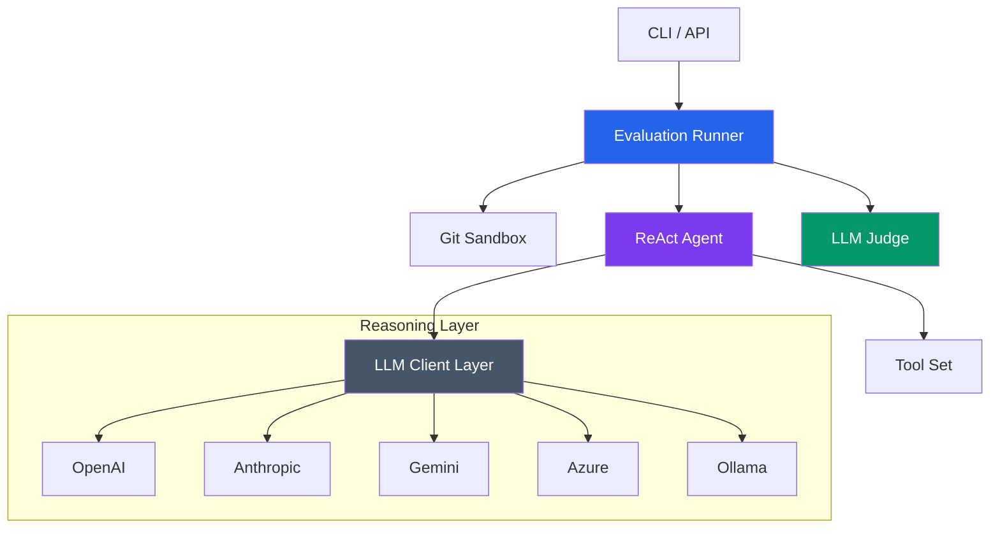

# Ruby Skill Bench 🚀


*A high-fidelity evaluation engine for benchmarking AI agent skills across any stack (Rails-first, but extensible).*

---

## 💎 The Vision

`ruby-skill-bench` is a deterministic evaluation engine designed to rigorously validate AI agent skills, context hydration strategies, and reasoning workflows. It orchestrates side-by-side execution runs within **Isolated Git Sandboxes**, providing objective, data-driven insights into agent reliability and code quality.

---

## ✨ Features

- **🎭 Side-by-Side Evaluation**: Quantify the "ROI of Context" by comparing baseline vs. skill-enhanced agent runs.
- **🛡️ Isolated Git Sandboxes**: Every run operates in a temporary repo. Clean diffs, zero side-effects, 100% reproducibility.
- **⚖️ Deterministic Scoring**: Composite scoring from test pass rate (50%), timing compliance (30%), and error handling (20%). Configurable thresholds via `criteria.json`.
- **🔄 Sophisticated ReAct Loop**: Employs a robust `Thought → Tool → Observation` loop to handle complex, multi-step engineering tasks.
- **🌍 Multi-Provider Ecosystem**: Native support for **OpenAI**, **Anthropic**, **Google Gemini**, **Azure OpenAI**, **Ollama**, **Groq**, **DeepSeek**, and **OpenCode**.
- **📊 Standardized Intelligence**: Consistent reporting format regardless of the underlying LLM provider.

---

## 🏛️ Architecture Overview

The system decoupling allows the reasoning engine to remain agnostic of the execution environment.



---

## ⚙️ Configuration & Orchestration

### Environment Variable Mapping

| Provider | Required Env Variables | Registry Key |
| :--- | :--- | :--- |
| **OpenAI** | `OPENAI_API_KEY` | `:openai` |
| **Anthropic** | `ANTHROPIC_API_KEY` | `:anthropic` |
| **Gemini** | `GEMINI_API_KEY`, `GEMINI_PROJECT_ID`, `GEMINI_LOCATION` | `:gemini` |
| **Azure** | `AZURE_OPENAI_API_KEY`, `AZURE_OPENAI_ENDPOINT`, `AZURE_OPENAI_MODEL` | `:azure` |
| **Ollama** | `OLLAMA_MODEL` (e.g., `qwen2.5-coder`) | `:ollama` |
| **Groq** | `GROQ_API_KEY` | `:groq` |
| **DeepSeek** | `DEEPSEEK_API_KEY` | `:deepseek` |
| **OpenCode** | `OPENCODE_API_KEY` | `:opencode` |

> **Note:** Environment variables are automatically loaded. You can also set provider config in `.skill-bench.json`.

### Global Configuration
```ruby
SkillBench::Config.setup do |config|
  config.current_llm_provider = :anthropic
  config.set_provider_model(:anthropic, 'claude-sonnet-4-20250514')
end
```

### Configuration Hierarchy

Configuration is loaded in this order (later sources override earlier ones):

1. **Code defaults** — built-in defaults for provider, model, and timeout
2. **Home JSON** — `~/.skill-bench.json` for user-wide settings
3. **Local JSON** — `./.skill-bench.json` for project-specific settings
4. **Environment variables** — provider API keys and models from `ENV`

---

## 🚀 Getting Started

### Installation
```bash
gem install ruby-skill-bench
```

Or add to your `Gemfile`:
```ruby
gem 'ruby-skill-bench'
```

### Usage: The 4-Step Flow

#### 1. Initialize Configuration
```bash
skill-bench init --rails
```
This creates `.skill-bench.json` with default providers and Rails-specific settings.

#### 2. Create a Skill
```bash
skill-bench skill new my-service --mode=rails --template=service_object
```
Creates `skills/my-service/service.rb` with a Rails service object template.

**Available Templates:**
- `service_object` → `service.rb`
- `concern` → `concern.rb`
- `active_record_model` → `model.rb`

#### 3. Create an Eval
```bash
skill-bench eval new my-first-eval --runtime=rails
```
Creates `evals/my-first-eval/` with `task.md` and `criteria.json`.

#### 4. Run the Eval
```bash
skill-bench run my-first-eval --skill=my-service --provider=openai
```

**Output Formats:**
- Human-readable (default)
- JSON: `--ci` flag
- JUnit XML: for CI/CD integration

---

## 📊 Scoring Engine

The `ScoringService` computes a deterministic composite score:

| Component | Weight | Description |
|-----------|--------|-------------|
| Test pass rate | 50% | Percentage of tests that passed |
| Timing compliance | 30% | Whether execution stayed within time budget |
| Error handling | 20% | Ratio of errors to total operations |

Thresholds are defined in `criteria.json`:

```json
{
  "runtime": "rails",
  "pass": {
    "score_threshold": 0.8
  },
  "fail": {
    "score_threshold": 0.5
  }
}
```

A score >= `pass.score_threshold` (default 0.8) marks the eval as passing.

---

## 🛡️ Reliability & Security

- **Safe-by-Design**: No code execution occurs on the host system; everything happens in the sandbox.
- **Command Blocklist**: Dangerous commands (`bash`, `sh`, `python`, `curl`, etc.) are always blocked, even if listed in `allowed_commands`.
- **Path Validation**: Eval paths are validated to prevent directory traversal attacks.
- **Atomic History Writes**: Benchmark history uses file locking to prevent corruption from concurrent writes.
- **URL Sanitization**: All provider URL parameters are CGI-escaped to prevent injection.
- **YAML Safety**: Config loading uses `permitted_classes: []` to prevent symbol DoS attacks.
- **Traceability**: Every thought and tool call is logged with full backtrace for post-mortem analysis.
- **Robust Error Recovery**: Handles provider outages and rate limits gracefully with standardized error logging.
- **XML-Safe Output**: JUnit XML output is properly escaped to prevent injection attacks.
- **Test Coverage**: 317+ tests covering core engine, CLI commands, and all provider clients.

## 🧪 Testing

The project uses Minitest with WebMock for HTTP stubbing.

```bash
# Run all tests
bundle exec rake test

# Run with coverage
bundle exec rake test COVERAGE=true

# Run specific test file
bundle exec ruby -Itest test/agent_eval/services/scoring_service_test.rb
```

**Test Structure:**
- `test/evaluator/` — Core evaluation engine tests
- `test/agent_eval/` — CLI, models, and service tests
- `test/clients/` — Provider client tests

## 📊 CI/CD Integration

GitHub Actions workflow included (`.github/workflows/ci.yml`):
- Runs on push and pull requests
- Tests against Ruby 3.3 and 3.4
- Executes rubocop, reek, and minitest
- Outputs JUnit XML for test reporting

```bash
# Run locally with CI output
skill-bench run my-eval --skill=my-skill --provider=openai --ci
```

---

## 📄 License
The gem is available as open source under the terms of the [MIT License](LICENSE).
