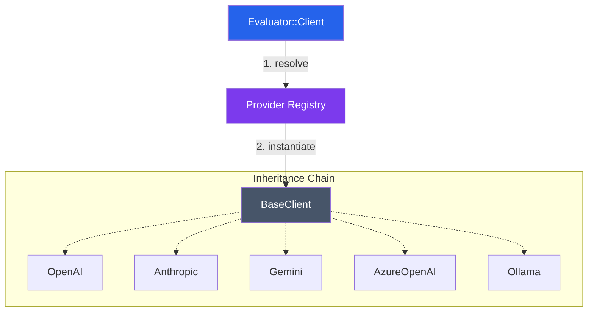

# 🧠 LLM Clients Layer

The `lib/clients` directory is the **Intelligence Bridge** of the Evaluator system. It provides a standardized, unified interface to interact with diverse Large Language Model (LLM) providers, from global leaders like OpenAI and Anthropic to local powerhouses via Ollama.

---

## 🏛️ Architecture & Patterns

The client layer is built on the **Template Method pattern** and a **Decoupled Provider Registry**, ensuring that adding a new AI backend requires zero changes to the core evaluation engine.

### System Flow


### Core Components
- **`BaseClient`**: The abstract backbone. It handles connection management (Faraday), JSON orchestration, standardized error recovery, and performance logging.
- **`ProviderRegistry`**: The discovery mechanism. It allows providers to self-register using unique symbols, enabling dynamic selection at runtime.
- **`ToolSet` Integration**: Clients are natively aware of tool definitions, translating them into the specific JSON schema required by each provider.

---

## 🛠️ Supported Providers

| Provider | Registry Key | Config Identity | Deployment Strategy |
| :--- | :--- | :--- | :--- |
| **OpenAI** | `:openai` | `OPENAI_*` | Global Cloud (GPT-4o, GPT-4 Turbo) |
| **Anthropic** | `:anthropic` | `ANTHROPIC_*` | Global Cloud (Claude 3.5 Sonnet, Opus) |
| **Google Gemini** | `:gemini` | `GEMINI_*` | Vertex AI / Google Cloud Platform |
| **Azure OpenAI** | `:azure` | `AZURE_OPENAI_*` | Enterprise Private Cloud (Azure) |
| **Ollama** | `:ollama` | `OLLAMA_*` | Local-First (Llama 3, Qwen, Mistral) |
| **Null Client** | `:null` | N/A | Mock / Fallback testing |

---

## 🔌 Configuration & Setup

### Environment Variable Mapping
The system supports direct injection via environment variables for rapid prototyping:

- **Azure OpenAI**: `AZURE_OPENAI_API_KEY`, `AZURE_OPENAI_ENDPOINT`, `AZURE_OPENAI_API_VERSION`
- **Gemini**: `GEMINI_API_KEY`, `GEMINI_PROJECT_ID`, `GEMINI_LOCATION`
- **Anthropic**: `ANTHROPIC_API_KEY`

### Registry Key Alignment
> [!IMPORTANT]
> When using the `Evaluator.set_provider(:key)` method, ensure the key matches the registry. Note that for Azure, the key is simply `:azure`.

---

## 🚀 Standardized Contract

Every client, regardless of its internal complexity, guarantees a standard response format. This allows the Evaluator to process results without caring about the source.

```ruby
# The "Golden" Response Format
{
  success: true,
  response: { 
    message: { 
      'content' => '...',      # String content
      'tool_calls' => [...]    # Optional tool interactions
    } 
  }
}
```

---

## 🧪 Adding Your Own Provider

1. **Subclass `BaseClient`**: Create `lib/clients/providers/my_ai.rb`.
        2. **Implement Methods**: Define `base_url`, `request_path`, `extract_message`, `valid_config?`, and `request_headers` (override to inject auth headers).
3. **Register It**:
   ```ruby
   Evaluator::Clients::ProviderRegistry.register(:my_ai, self)
   ```
4. **Load It**: Ensure it is required in the main `lib/client.rb` or your entry point.

---

## 🛡️ Resilience & Observability

- **Timeouts**: Every request is guarded by a 60s timeout (configurable).
- **Silent Errors**: We prioritize "Fail Fast, Fail Clean". Errors are caught, logged with 5-line backtraces, and returned as `{ success: false }`.
- **JSON Safety**: Robust parsing prevents malformed LLM responses from crashing the system.
