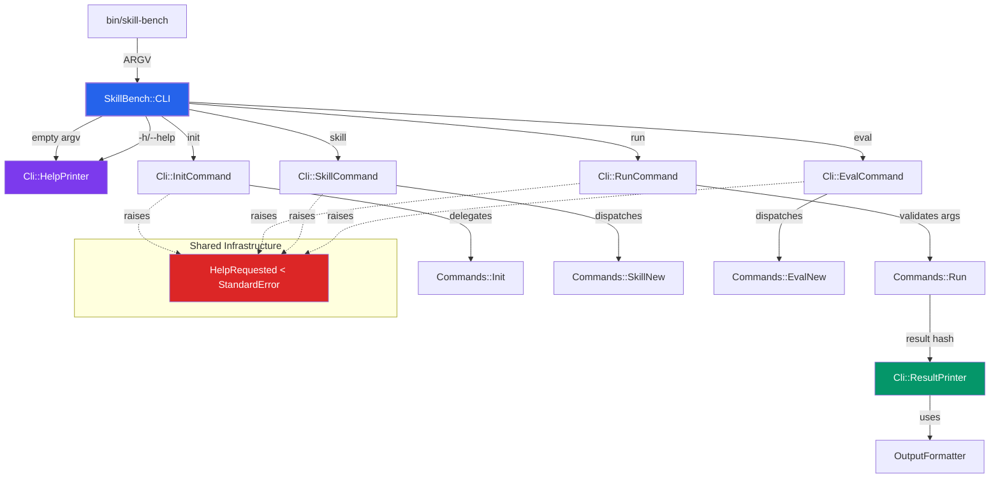

# 🖥️ CLI Layer

The `lib/skill_bench/cli` directory is the **Command Interface** of the SkillBench system. It provides a thin, composable dispatcher that routes user input to the appropriate subcommand handlers while maintaining consistent error handling, exit codes, and output formatting.

---

## 🏛️ Architecture & Patterns

The CLI layer is built on the **Dispatcher Pattern** with **Command Objects**, ensuring that adding a new subcommand requires minimal changes to the core routing logic.

### System Flow



### Core Components

- **`CLI`**: The top-level dispatcher. Receives raw `ARGV`, routes to subcommand handlers via `case/when`, and handles unknown subcommands.
- **`InitCommand`**: Parses provider flags (`--openai`, `--gemini`, etc.) and `--force`. Delegates to `Commands::Init` to generate `skill-bench.json`.
- **`RunCommand`**: Parses `--skill` and `--format` flags. Validates required arguments before delegating to `Commands::Run`.
- **`SkillCommand` / `EvalCommand`**: Action dispatchers that route to `new` sub-actions (`skill new`, `eval new`) with their own OptionParsers.
- **`HelpPrinter`**: Renders the global usage message with all subcommands and their flags.
- **`ResultPrinter`**: Formats evaluation results and returns the appropriate exit code (0 for pass, 1 for fail).

---

## 🎯 Design Principles

### Composable Exit Codes

Every command handler returns an `Integer` exit code instead of calling `Kernel.exit`. This makes commands testable and composable:

```ruby
# In bin/skill-bench
exit SkillBench::CLI.call(ARGV)

# In tests
assert_equal 0, RunCommand.call(['my-eval', '--skill=my-skill'])
```

### Sentinel Exception for Help

The `HelpRequested` exception is a sentinel used to abort OptionParser cleanly:

```ruby
opts.on('-h', '--help', 'Prints this help') do
  puts opts
  raise SkillBench::HelpRequested
end
```

The `call` method rescues this before `StandardError` and returns `0`:

```ruby
rescue SkillBench::HelpRequested
  0
rescue StandardError => e
  warn "Error: #{e.message}"
  1
end
```

### Consistent Error Handling

All commands follow the same error-handling pattern:
- `HelpRequested` → return `0` (expected, not an error)
- `StandardError` → print to stderr, return `1`
- Validation errors (missing args) → print usage hint, return `1`

---

## 🚀 Exit Code Reference

| Exit Code | Meaning |
|-----------|---------|
| `0` | Success or help requested |
| `1` | Error (missing args, unknown subcommand, runtime failure) |
| `130` | Interrupted (Ctrl+C) — handled in `bin/skill-bench` |

---

## 🛠️ Adding a New Subcommand

1. **Create the command class** in `lib/skill_bench/cli/my_command.rb`:

   ```ruby
   # frozen_string_literal: true

   require 'optparse'

   module SkillBench
     module Cli
       class MyCommand
         def self.call(argv)
           new(argv).call
         end

         def initialize(argv)
           @argv = argv
         end

         def call
           options = {}
           parser = build_parser(options)
           parser.parse!(@argv)

           # Validate and execute
           Commands::MyCommand.run(**options)
           0
         rescue SkillBench::HelpRequested
           0
         rescue StandardError => e
           warn "Error: #{e.message}"
           1
         end

         private

         def build_parser(options)
           OptionParser.new do |opts|
             opts.banner = 'Usage: skill-bench my [options]'
             opts.on('--flag VALUE', 'Description') { |v| options[:flag] = v }
             opts.on('-h', '--help', 'Prints this help') do
               puts opts
               raise SkillBench::HelpRequested
             end
           end
         end
       end
     end
   end
   ```

2. **Register it in the dispatcher** (`lib/skill_bench/cli.rb`):

   ```ruby
   require_relative 'cli/my_command'

   # In CLI#call
   when 'my' then Cli::MyCommand.call(@argv)
   ```

3. **Update `HelpPrinter`** to include the new subcommand in the usage message.

4. **Write tests** in `test/cli/my_command_test.rb` following the existing patterns.

---

## 🧪 Testing CLI Commands

CLI commands are fully testable without spawning subprocesses:

```ruby
# Test help output
assert_output(/Usage: skill-bench/) do
  exit_code = SkillBench::Cli::HelpPrinter.call
  assert_equal 0, exit_code
end

# Test argument validation
assert_equal 1, SkillBench::Cli::RunCommand.call([])

# Test successful execution
assert_equal 0, SkillBench::Cli::InitCommand.call(['--openai'])
```

---

## 📁 File Structure

| File | Responsibility |
|------|---------------|
| `cli.rb` | Top-level dispatcher, `HelpRequested` exception |
| `init_command.rb` | `skill-bench init --<provider>` handling |
| `run_command.rb` | `skill-bench run <eval> --skill <name>` handling |
| `skill_command.rb` | `skill-bench skill new <name>` dispatch |
| `eval_command.rb` | `skill-bench eval new <name>` dispatch |
| `help_printer.rb` | Global usage message rendering |
| `result_printer.rb` | Evaluation result output + exit code |

---

## 🔗 Related Documentation

- `lib/skill_bench/commands/` — Domain command implementations
- `lib/skill_bench/output_formatter.rb` — Output formatting (human, JSON, JUnit)
- `docs/first-eval-guide.md` — User-facing CLI tutorial
